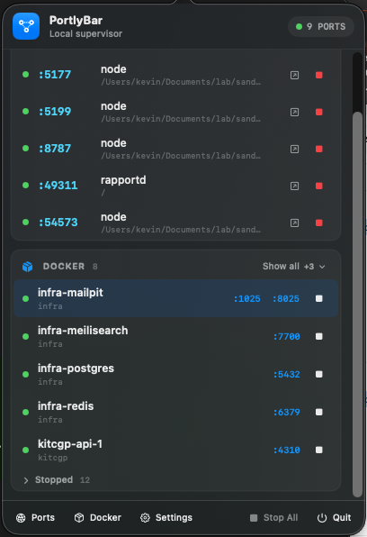
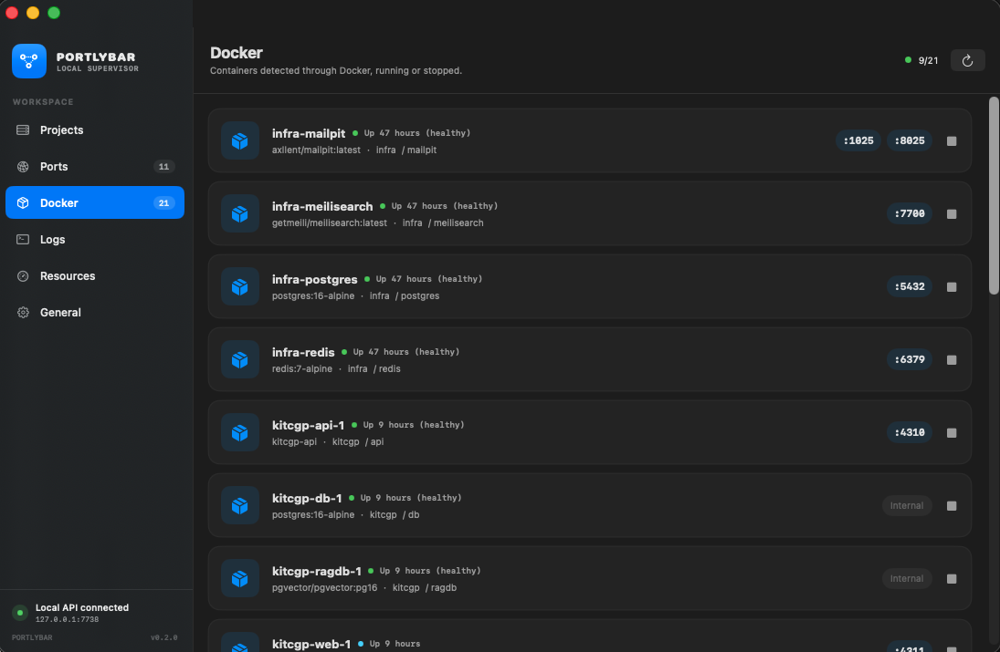
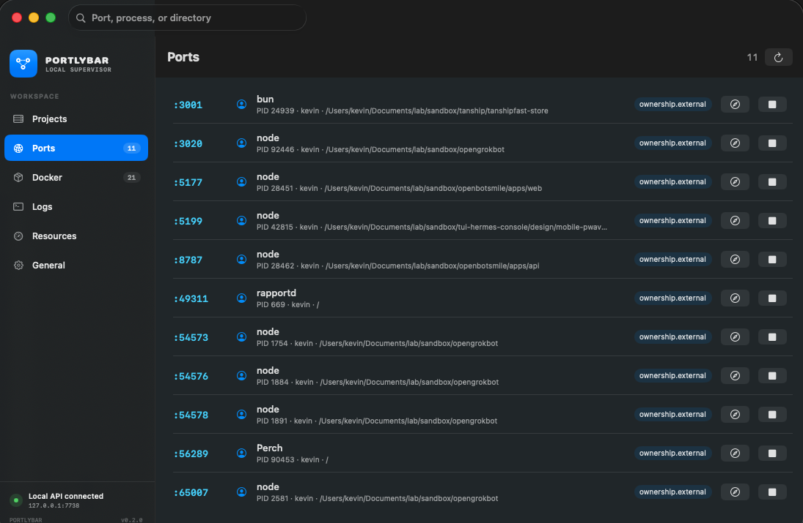

# PortlyBar

PortlyBar is a native Swift 6 macOS menu-bar supervisor for local development servers. It runs commands in real pseudo-terminals, tracks ports, checks health, preserves ANSI logs, samples CPU and memory, and exposes the same state through a loopback-only API and the `portlybar` CLI.

```text
MenuBarExtra + Settings + CLI
              |
          Supervisor
       /       |       \
     PTY     Health    Ports
      |        |        |
 config.json + logs + 127.0.0.1:7738
```

## Screenshots

<!-- Drop the PNGs in docs/screenshots/ under these exact names and the images below light up. -->

|                                                                          |                                                                            |
| ------------------------------------------------------------------------ | -------------------------------------------------------------------------- |
| <br>Menu bar: detected ports and Docker containers, each stoppable in place | <br>Docker: running and stopped containers, started or stopped from the app |
| <br>Ports: every TCP listener, labelled managed, external, or protected | <br>Logs: live ANSI output from a real pseudo-terminal |

## Build

Requirements: macOS 14+, Swift 6, and Xcode command-line tools.

```sh
swift test
./build.sh
open dist/PortlyBar.app
```

`build.sh` creates an Apple-silicon, ad-hoc-signed app at `dist/PortlyBar.app`. It does not install or launch anything by default. `./build.sh --install` refuses to overwrite an existing `/Applications/PortlyBar.app`; `--run` opens the build in `dist`.

## CLI

The CLI is built at `.build/release/portlybar` and bundled in `PortlyBar.app/Contents/Resources/bin/portlybar`.

```sh
portlybar status --details
portlybar add-project --name demo --path /absolute/path
portlybar add-server --project demo --name web --command 'npm run dev' --port 3000 --start
portlybar logs demo/web --tail 200
portlybar http-server 'npm run dev -- --port "$PORT" --host "$HOST"' --path /absolute/path --json
portlybar stop-temp tmp_example --json
```

External process actions require explicit `--confirm`; SIGKILL also requires `--force`. PortlyBar revalidates the PID and port immediately before signaling.

At launch, the app synchronizes its managed skills with detected Claude Code, Codex, OpenCode, Gemini CLI, Cursor, and generic Agent Skills directories. Managed copies are updated by hash; local modifications and unrelated skills are never overwritten. The bundled CLI is linked to `~/.local/bin/portlybar` when that path is free.

## Data and privacy

- Configuration: `~/.config/portlybar/config.json`
- Logs: `~/.config/portlybar/logs/`
- API: `127.0.0.1:7738`, with browser-originated requests rejected
- Agent skill receipt: `~/.agents/.portlybar-skills.json`
- Telemetry: none
- Sparkle: linked but inactive until a signed distribution provides an HTTPS appcast and EdDSA public key

Environment values are stored in plain text in `config.json` and are not written to logs by PortlyBar.
